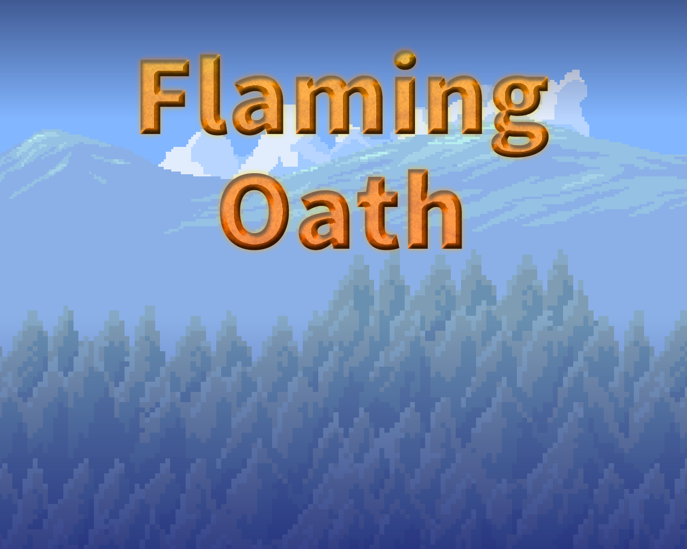

# Fantasy-Game-Project
The final project for the C++ 2D Game Development course with Professor Roy.
In this game, you play as a powerful wizard who is just starting
to learn how to use their magic. You job is to defend a village from evil dragons,
who have suddenly started to attack after 1000 years of peace.

## Trailer
[Link to the trailer video](https://www.youtube.com/watch?v=5MXwiNZBJyA)

[Link to a full gameplay video](https://youtu.be/P28g4eQVHQg)

## Usage
Run the command `make` to build the project.

Then run the file `./a.out` to run the game.

#### Overview
`Mouse` - use the mouse to click buttons on the menus (title screen, game over, pause, and victory screen)

`Escape` - pause the game at any Time

`Space` - progress dialogue (unless the dialogue tells you to press a different button)

`A` - move left

`D` - move right

`J` - cast your fire spell

To play the game, use 'A' and 'D' to move left anf right, respectively. Try to avoid the fire! In the beginning of the game, you will see a title screen, and then some 
dialogue. Use the mouse to navigate the title screen, and use the space bar to progress 
diaglogue.

Use 'J' to launch fireballs upwards towards the dragon to fight back! If you defeat the dragon, you will win the game. If you touch the dragon's fire, you will lose health. If you reach 0 health, the game will end.

## Credits
### Assets
- Music from https://patrickdearteaga.com
- [Forest background from ansimuz on itch.io](https://ansimuz.itch.io/country-side-platfformer?download) 
- [Wizard Sprite from pngwing.com](https://www.pngwing.com/en/free-png-yvcqn)
- [Cabin font from Google Fonts](https://fonts.google.com/specimen/Cabin)
- [Dragon Sprites from MasuOne on itch.io](https://masuone.itch.io/dragons-pack-free)
- [Fire Sprites from BowchersPrincipal](https://www.deviantart.com/bowchersprincipal/art/kirby-Dragon-fire-sprite-sheet-767796025)
- [Heal Spell Sprite by ansimuz on itch.io](https://ansimuz.itch.io/gothicvania-magic-pack-9)
- [Star Background by aamatniekss on itch.io](https://aamatniekss.itch.io/sci-fi-space-background-set)
  > This asset is not free, but I got it as part of a bundle last year and did not just buy it for this project :)
- Dialogue boxes, heart meters, villager sprite made by Alex

### Work Distribution
#### Jhonder
- Collision with the screen border and fire
- Sound effects
- Dragon random number generator
- Player and dragon collision
- Player spells and sprites with player inputs
- Merging of mines and Alex's version
- Dragon up, down, and sideways movement

#### Alex
- Entity class inheritance
  - Heart meter above entities
- Level class and main gameplay loop logic
- Pause/Title/Game Over/End Screens
  - MouseButton class for menus
- Time singleton class for accessing DeltaTime
- InputManager singleton class for accessing inputs
- Dialogue & TextObject classes for interactive dialogue

### Resources
- [Using a `std::map` like a dictionary for associating characters with avatars](https://www.geeksforgeeks.org/map-associative-containers-the-c-standard-template-library-stl/)
- [Using `std::vector`s to create lists of varying size](https://www.geeksforgeeks.org/vector-in-cpp-stl/)
- [Using the `new` keyword to create pointers to objects that will not fall out of scope](https://stackoverflow.com/questions/655065/when-should-i-use-the-new-keyword-in-c)
- [Implementing the singleton pattern in C++ to have globally accessible classes (like Time)](https://refactoring.guru/design-patterns/singleton/cpp/example)

This game was made with SFML and C++ for Professor Roy's 2D Game Development with C++ class! Thank you Professor Roy for a great class and a fun semester!